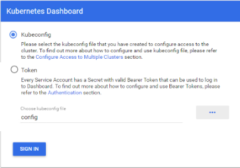
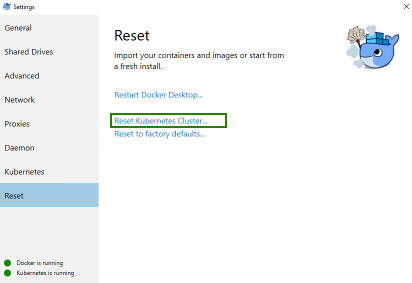

# Kubernetes

## Prerequisites

- Hyper-V     
[Hyper-V Install](hyper-v.md)
- Powershell  > 6.2   
https://github.com/PowerShell/PowerShell

- Chocolatey   
https://chocolatey.org/docs/installation

- Choco Essentials
```
choco install vscode
choco install cmder
choco install googlechrome
choco install openssh
```

## Install Docker Desktop for Windows

```
choco install docker-desktop
choco install kubernetes-helm
```


#### Verify Instalation 

```
kubectl version

kubectl config current-context

kubectl cluster-info

kubectl get nodes
```

### Installating the Kubernetes Dashboard

```
kubectl apply -f https://raw.githubusercontent.com/kubernetes/dashboard/v1.10.1/src/deploy/recommended/kubernetes-dashboard.yaml
```

#### Enable Dashboard & Create Access Token

```
kubectl proxy
```

```
$TOKEN=((kubectl -n kube-system describe secret default | Select-String "token:") -split " +")[1]

kubectl config set-credentials docker-for-desktop --token="${TOKEN}"
```

#### Access Dashboard

```
http://localhost:8001/api/v1/namespaces/kube-system/services/https:kubernetes-dashboard:/proxy/ 
```

```
Click on Kubeconfig and select the “config” file under C:\Users<Username>.kube\config
```



## Helm

```
helm init
```
#### Verify 

```
kubectl get pods -n kube-system
```

```
cd /helm
helm install --name microservice-release --namespace microservices ./microservice-stack

helm status microservice-release

kubectl get pods -n microservices
```

### Node Ports

```
kubectl get svc -n microservices
```

### Update Release
```
helm upgrade microservice-release ./microservice-stack
```

## Reset Kubernetes



## References

```
http://collabnix.com/kubernetes-dashboard-on-docker-desktop-for-windows-2-0-0-3-in-2-minutes/
```
