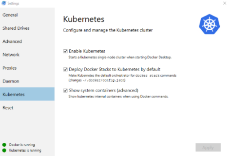

# Kubernetes

## Prerequisites

- Hyper-V     
[Hyper-V Install](hyper-v.md)
- Powershell  > 6.2   
https://github.com/PowerShell/PowerShell

- Chocolatey   
https://chocolatey.org/docs/installation

- Choco Essentials
```
choco install vscode
choco install googlechrome
choco install openssh
```

## Install Docker Desktop for Windows

```
choco install docker-desktop
choco install kubernetes-helm
```




#### Verify Instalation 

```
kubectl version

kubectl config current-context

kubectl cluster-info

kubectl get nodes
```

### Installating the Kubernetes Dashboard

```
kubectl apply -f https://raw.githubusercontent.com/kubernetes/dashboard/v1.10.1/src/deploy/recommended/kubernetes-dashboard.yaml
```

#### Enable Dashboard & Create Access Token

```
kubectl proxy
```

```
$TOKEN=((kubectl -n kube-system describe secret default | Select-String "token:") -split " +")[1]
kubectl config set-credentials docker-for-desktop --token="${TOKEN}"
```

#### Access Dashboard

```
http://localhost:8001/api/v1/namespaces/kube-system/services/https:kubernetes-dashboard:/proxy/ 
```

```
Click on Kubeconfig and select the “config” file under C:\Users<Username>.kube\config
```


```
helm init command to initilaize the helm tiller. 
once the helm tiller is in running state. you could check it status via 
kubectl get pods -n kube-system

tiller pod should be running

To helm install helm chart use 

helm install -n name_of_relaese --namespace microservices. 

where -n is for the name of the release you could name it any. 
and if you want to install in a specifi namespace use --namespace=name 
and dot at the end to provide the location of the chart. as we are in the directory of helm chart 
so we can directly give the path using . 

to check status use
helm status name_of_relaese

or kubectl get pods -n namespace_name 

to get the node port to open use 

kubectl get svc -n namespace_name 
```


### References 

```
http://collabnix.com/kubernetes-dashboard-on-docker-desktop-for-windows-2-0-0-3-in-2-minutes/
```

*************************************************************************************

# BELOW ARE NOTES CAN BE REMOVED


## Helm and Tiller

```
kubectl config view
```

```
apiVersion: v1
clusters:
- cluster:
    certificate-authority: C:\Users\stuar\.minikube\ca.crt
    server: https://192.168.99.100:8443
  name: minikube
contexts:
- context:
    cluster: minikube
    user: minikube
  name: minikube
current-context: minikube
kind: Config
preferences: {}
users:
- name: minikube
  user:
    client-certificate: C:\Users\stuar\.minikube\client.crt
    client-key: C:\Users\stuar\.minikube\client.key
```

## Starting Helm

```
helm init

kubectl describe deploy tiller-deploy --namespace=kube-system
```

[!NOTE] This is a note which needs your attention, but it's not super important.


```
kubectl create serviceaccount --namespace kube-system tiller

kubectl create clusterrolebinding tiller-cluster-rule --clusterrole=cluster-admin --serviceaccount=kube-system:tiller
```

